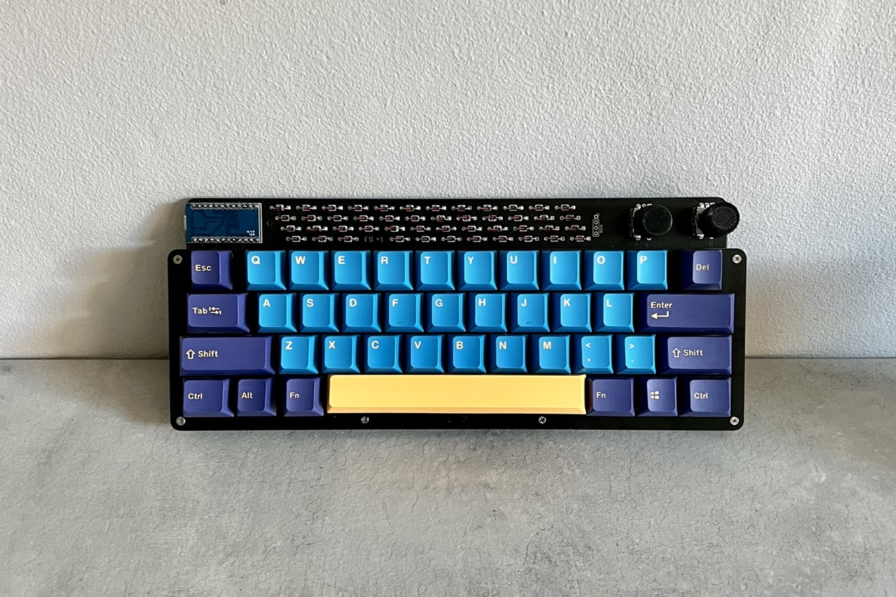
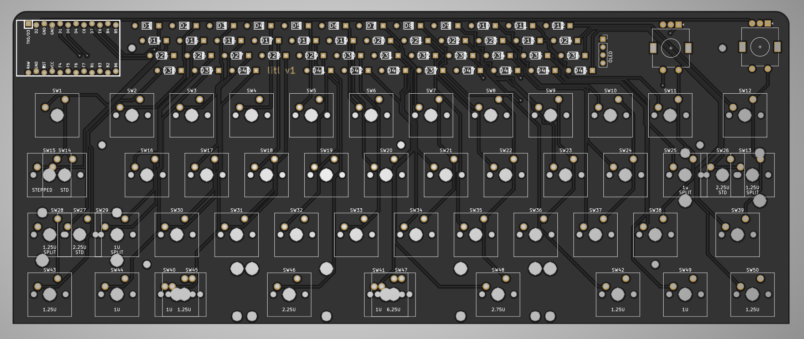
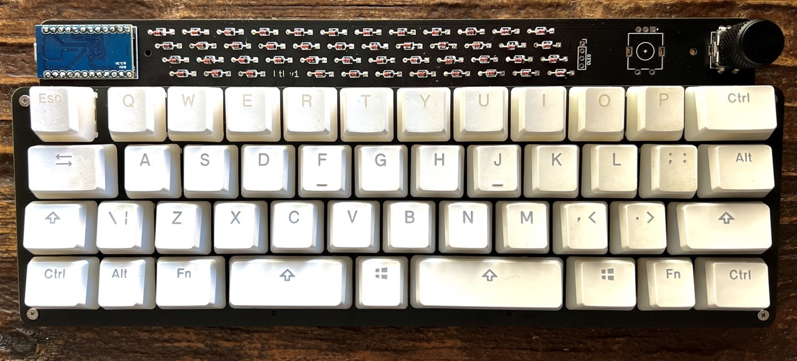

# litl
Litl is an easy to build 40% keyboard using only through hole components. It uses a separate microcontroller (like the Pro Micro or Elite C) to enable flexibility in connectivity and to further simplify the soldering experience (no more tricksy USB ports).

[License](LICENSE)

Litl is licensed under the [Creative Commons Attribution-NonCommercial 4.0 International license](https://creativecommons.org/licenses/by-nc/4.0/). This design as it stands in this repository may be freely reproduced, modified, and manufactured for PERSONAL USE ONLY and may not be reproduced in physical form for public sale. 

Litl kits are available for sale at [sthlmkb.com](https://sthlmkb.com)

## Features
* Only through hole components for easy soldering
* Separate microcontroller using Pro micro, Elite C, Nice! Nano or equivalent footprint. So micro USB, USB-C or Bluetooth are all options!
* 1 or 2 rotary encoders
* OLED screen (though only 1 rotary encoder is possible if using OLED)
* Multiple layout options including split space (2.25u + 1u + 2.75u), split left shift (1.25u + 1u), split enter (1u + 1.25u) and stepped capslock ([layout](http://www.keyboard-layout-editor.com/##@_name=litl&author=mohoyt;&@_x:10.75&c=#82e0f5;&=Enc%202&_x:0.25&w:2.25;&=OLED&_x:0.25&c=#cccccc;&=Enc;&@_y:0.25&x:2.5&w:1.5;&=Esc&=Q&=W&=E&=R&=T&=Y&=U&=I&=O&=P&_w:1.5;&=Back%3Cbr%3ESpace;&@_c=#ebbebe&w:1.25&w2:1.75&l:true;&=Tab&_x:1.25&w:1.75;&=Tab&_c=#cccccc;&=A&=S&=D&=F&=G&=H&=J&=K&=L&_c=#aee6cb&w:2.25;&=Enter;&@_c=#dfe6ba&w:2.25;&=Shift&_x:0.25&w:1.25;&=Shift&=%60%0A~&_c=#cccccc;&=Z&=X&=C&=V&=B&=N&=M&=%3C%0A,&=%3E%0A.&_w:1.75;&=Shift;&@_x:2.5&w:1.25;&=Ctrl&=Alt&_c=#a8abed&w:1.25;&=Cmd&_a:7&w:2.25;&=&_a:4;&=Super&_a:7&w:2.75;&=&_c=#cccccc&a:4&w:1.25;&=Cmd&=Alt&_w:1.25;&=Ctrl;&@_y:0.25&x:4.75&c=#a8abed;&=Cmd&_a:7&w:6.25;&=&_x:1.25&c=#aee6cb&a:4;&='%0A%22&_w:1.25;&=Enter"))
* Open and visible components (in the style of Plaid, Romac etc)
* Simple and flexible case options 

## Components required 
* PCB
* FR4 Switch plate
* FR4 Base 
* Controller (e.g. Pro micro, Elite C, Nice! Nano or something with similar footprint/pinout)
* Switches (5 pin MX footprint) (up to 45)
* Diodes (47)
* Rotary encoders (1 or 2)
* Rotary encoder knobs (1 or 2)
* 0.91" OLED screen 
* 10mm M2 Standoffs (6 required if mounting the base to the plate)
* Acrylic cover for the components at the top (optional)
* Stabilisers (PCB mount) (4 x 2u or 2 x 2u + 6.25u or 2 x 2u depending on layout)
* Rubber feet for the base

[Build guide](build_guide.md)

## Known issues 
Will be fixed in v2 but are present in v1
* Esc key is missing holes for 5 pin switches (workaround is to cut the pins off that switch to make it 3 pin and with the plate it will still be stable)
* Track routing goes under the front logo and makes it less clear, needs rerouting slightly
* OLED pins are reversed so the OLED has to be mounted facing left (over the diodes) instead of right

