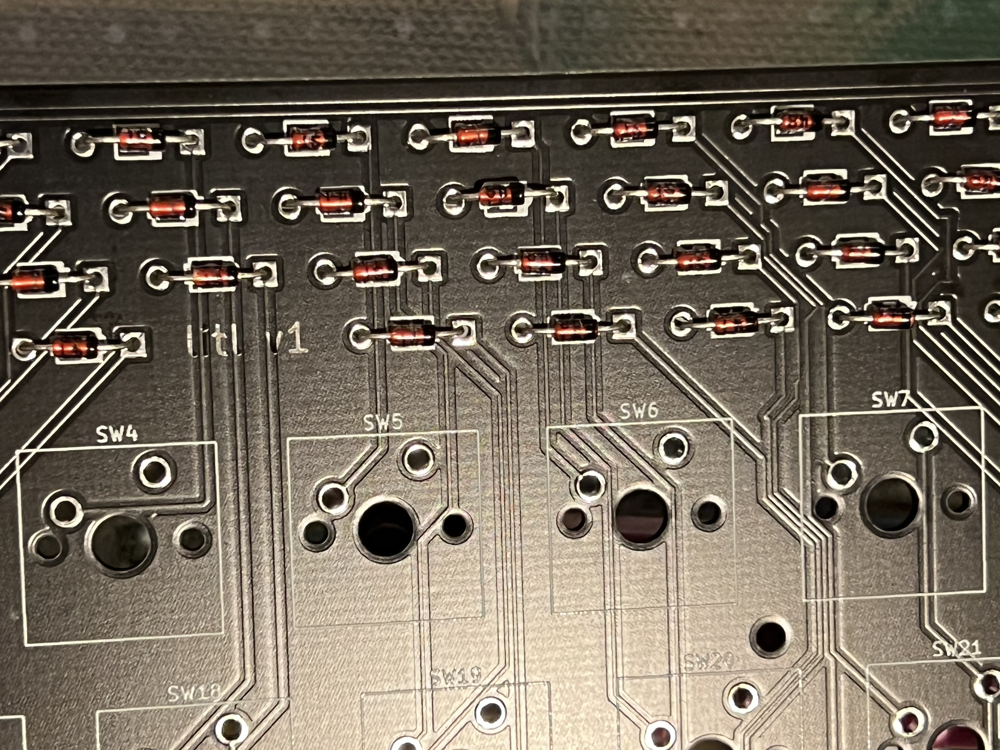
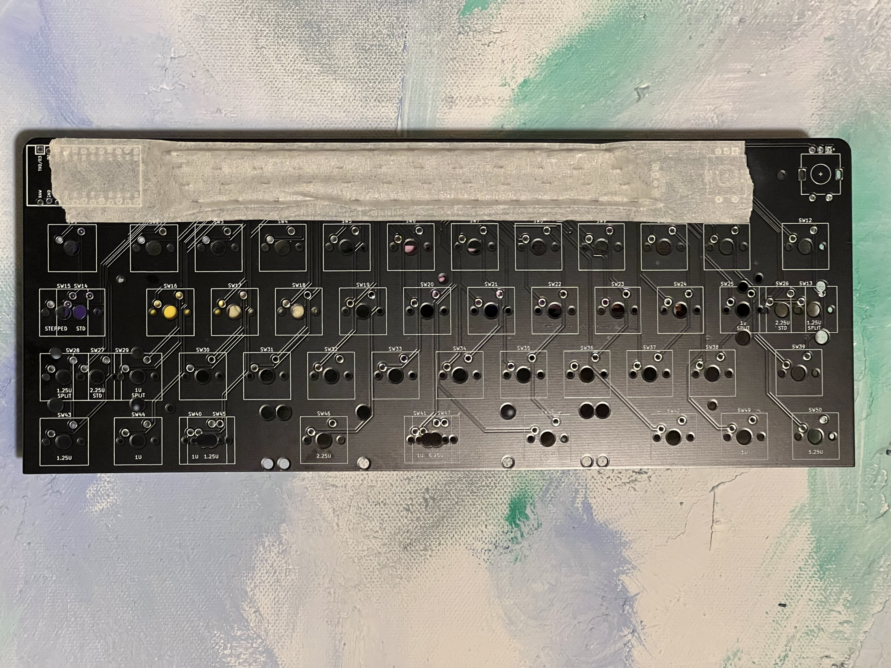
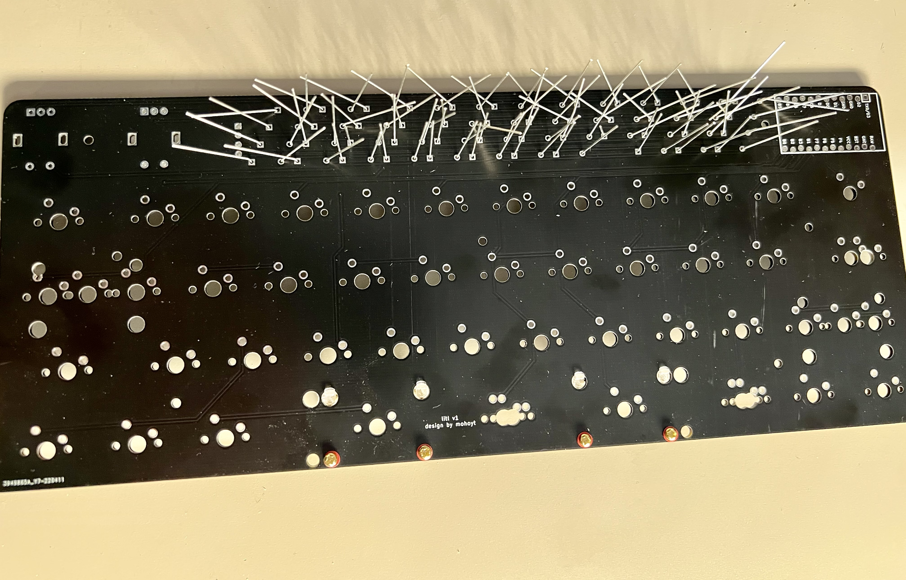
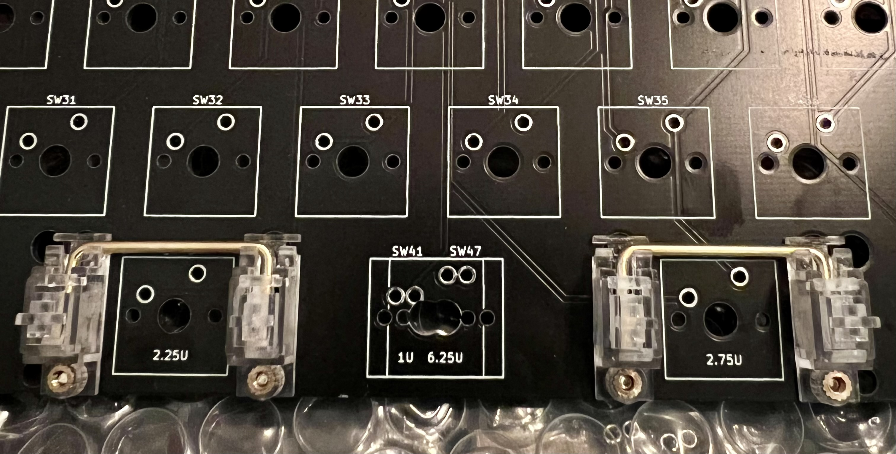
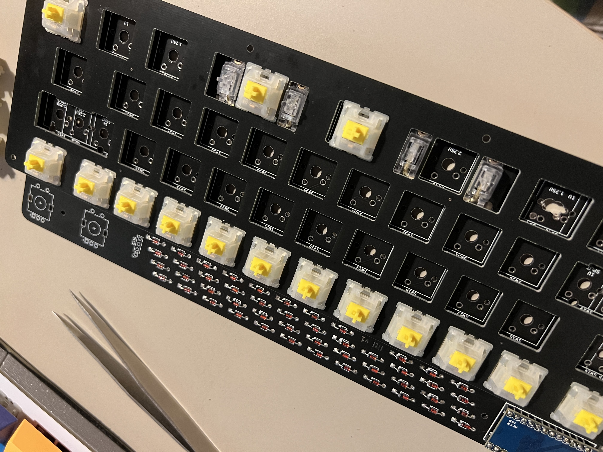
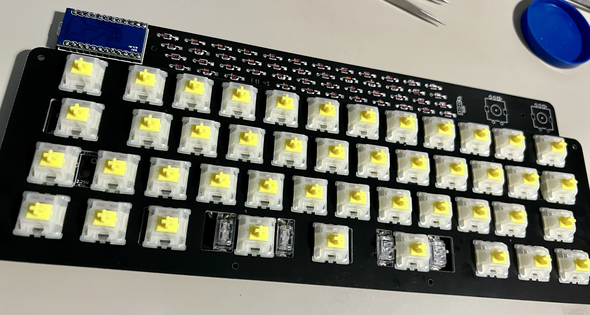
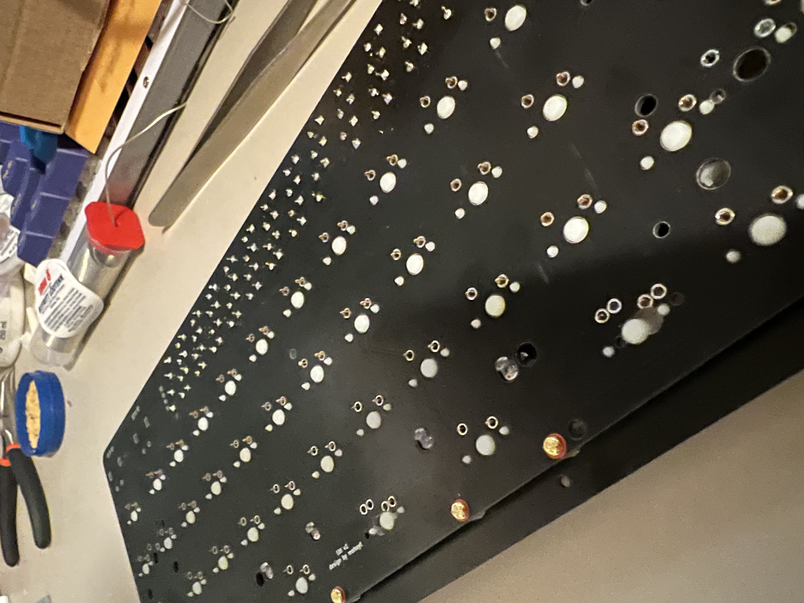
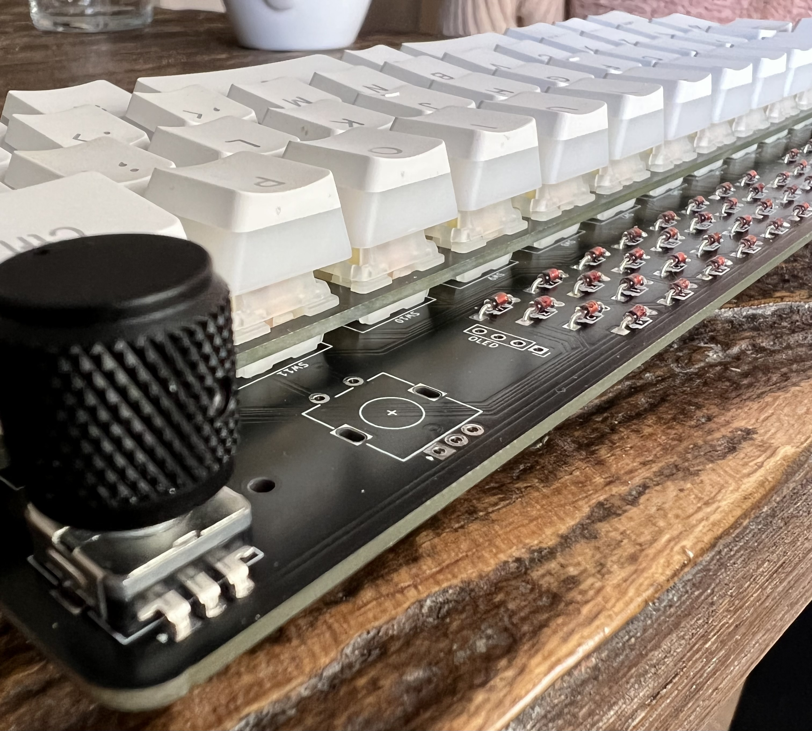

# Litl build guide

## Components required 

* PCB
* FR4 Switch plate
* FR4 Base 
* Controller (I used a pro micro in the guide but anything that shares the footprint and pinout will be fine e.g. Elite C or Nice! Nano)
* Diodes (47)
* Switches (5 pin MX footprint) (up to 45)
* Rotary encoders (1 or 2)
* Rotary encoder knobs (1 or 2)
* 0.91" OLED screen (optional)
* 10mm M2 Standoffs (6 required if mounting the base to the plate)
* 6mm x M2 screws for attaching the standoffs to the plate/base (2 per standoff so 12 total)
* Acrylic cover for the components at the top (optional, not included)
* Stabilisers (PCB mount) (4 x 2u or 2 x 2u + 6.25u or 2 x 2u depending on layout)
* Rubber feet for the base

## You will also need

* Soldering iron
* Solder
* Diode bender (helpful but not required, I used [this one](https://www.printables.com/model/23523-1n4148-diodes-bending-jig))

## Step by step

1. Check that you have all the components you need.

2. Start by bending all the diodes (I used the 3d printed diode bender above). And then place them in the sockets, ensuring that you have the *correct orientation*, the black line on the diode should match the white lines on the board. I then placed some tape over the diodes to hold them in place while I flipped over the board to solder them.

3. Solder the diodes on (I soldered on the underside of the board) and trim their legs once the solder has cooled

4. Flash your controller and check that it is working as expected (e.g. when you plug it into the computer it is recognised as a USB keyboard device). See flashing instructions here.
5. Solder your controller to the board. The board has offset holes so that hotswapping might work, but this didn't go so great in practice so I just soldered my controller on. You are of course very welcome to socket your controller too if you value switchability. I soldered headers onto my controller and then soldered everything onto the PCB and then trimmed the legs on the underside of the PCB. *Orientation matters* here so ensure that you have the controller in the right position. 

6. Now you should be able to plug in your board and test that all keystrokes are recognised. I used a pair of tweezers to short the switch sockets for this. 

7. Add the stabilisers. Hopefully by now you should know what layout you want, but if you don't then now's a good time to choose! I used some PCB mounted screw in stabs in the photos. 

8. Start by placing a couple switches in the corners of the plate and then attach the plate to the PCB ensuring that you don't bend any pins while doing so. Continue placing the rest of the switches until all keys are present. I used Gateron Pro Yellows in the photos with all of the split options. You cal also add the encoders and the OLED screen at this point if you're going with these options.

9. Double check that your stabilisers are all correct (i.e. the wires are seated securely) and lubed as there's no going back once you've soldered switches in. Check again that that none of the switch pins are bent. 

10. Start soldering all the switches, OLED and encoders in place. Double check that you've not missed anything (it's easy to overlook a few)
11. Attach the standoffs to the screws on the edges of the switch plate and position the base plate correctly and screw in the screws from the bottom too. Add the rubber bumbers to the base plate.
12. Add some keycaps and encoder knobs and *you are done!* Have a test that everything's working as expected and maybe update/flash some new firmware if you feel like it. Enjoy!
